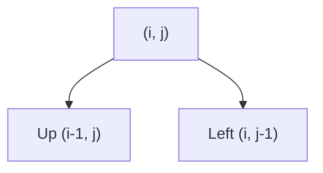

<h2><a href="https://leetcode.com/problems/unique-paths">62. Unique Paths</a></h2>

<p>There is a robot on an <code>m x n</code> grid. The robot is initially located at the <strong>top-left corner</strong> (i.e., <code>grid[0][0]</code>). The robot tries to move to the <strong>bottom-right corner</strong> (i.e., <code>grid[m - 1][n - 1]</code>). The robot can only move either down or right at any point in time.</p>

<p>Given the two integers <code>m</code> and <code>n</code>, return <em>the number of possible unique paths that the robot can take to reach the bottom-right corner</em>.</p>

<p>The test cases are generated so that the answer will be less than or equal to <code>2 * 10<sup>9</sup></code>.</p>

<p>&nbsp;</p>
<p><strong class="example">Example 1:</strong></p>

<pre><strong>Input:</strong> m = 3, n = 7
<strong>Output:</strong> 28
</pre>

<p><strong class="example">Example 2:</strong></p>

<pre><strong>Input:</strong> m = 3, n = 2
<strong>Output:</strong> 3
<strong>Explanation:</strong> From the top-left corner, there are a total of 3 ways to reach the bottom-right corner:
1. Right -&gt; Down -&gt; Down
2. Down -&gt; Down -&gt; Right
3. Down -&gt; Right -&gt; Down
</pre>

<p>&nbsp;</p>
<p><strong>Constraints:</strong></p>

<ul>
	<li><code>1 &lt;= m, n &lt;= 100</code></li>
</ul>


---

# 🛍️ Unique-Paths | Explained

## Approach 1: Top-Down DP (Memoization)
### Intuition
Traverse backward from target to start, summing paths from above and left while caching results.

### Algorithm Visualized


### Approach
Recursively move up/left from $(m-1, n-1)$. Store computed paths in `dp` matrix to eliminate overlapping subproblems.

### Detailed Code Analysis
`solve()` checks base cases (target hit = 1, out-of-bounds = 0), fetches memoized values, and stores recursive subproblem sums into `dp[i][j]`.

### Code
```cpp
class Solution {
public:
    int solve(int i, int j, vector<vector<int>>& dp) {
        if(i==0 && j==0) return 1;
        if(i<0 || j<0) return 0;
        if(dp[i][j]!=-1) return dp[i][j];
        return dp[i][j] = solve(i-1, j, dp) + solve(i, j-1, dp);
    }
    int uniquePaths(int m, int n) {
        vector<vector<int>> dp(m, vector<int>(n, -1));
        return solve(m-1, n-1, dp);
    }
};
```

### Complexity
- **Time:** $O(m \times n)$
- **Space:** $O(m \times n)$

## 🕵️‍♂️ Follow-up Questions
- **Optimize space?** Yes, to $O(n)$ using 1D DP or $O(1)$ via combinatorics.